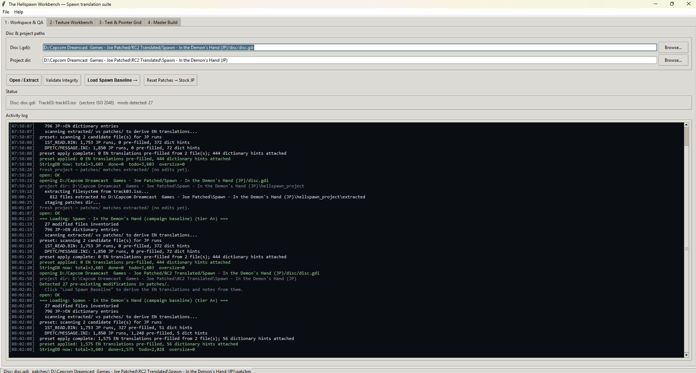
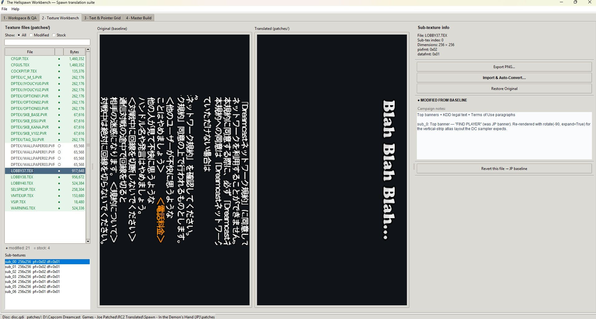
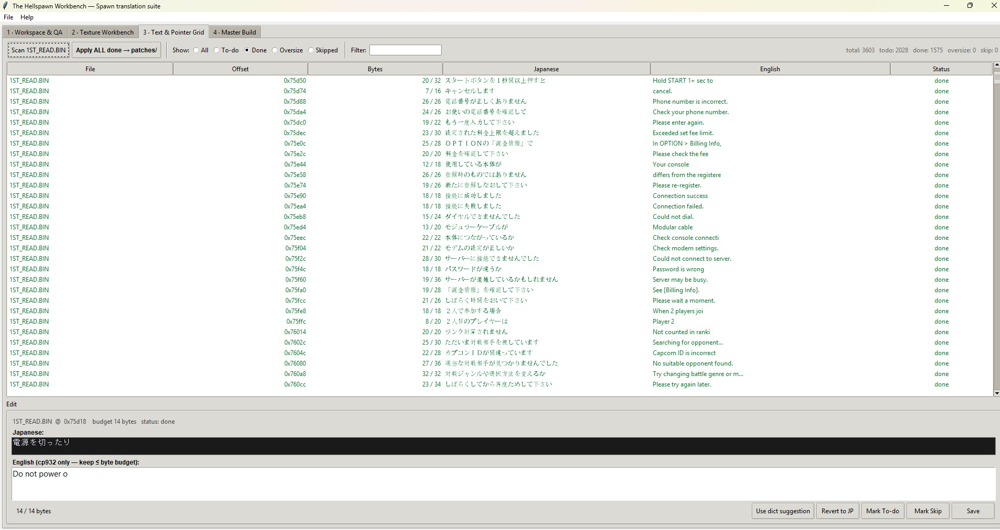

# SpawnTools — v1.1.0

**GUI for translating all 15 Capcom Dreamcast titles, built on the codec library used to ship the existing Spawn EN patch.**

```
   Windows:  double-click spawntools.bat
   Linux:    ./spawntools.sh
   macOS:    ./spawntools.sh
```

The launcher checks for Python 3.10+, installs Pillow + numpy on first run if missing, then starts the GUI. All codec logic, the JP→EN dictionary, and **all 15 game baselines** are bundled inside the package — no external path config required.

## What's in v1.1.0

Open any of the 15 supported discs — the tool auto-detects the game via the Sega IP.BIN product code and pre-fills the right scan targets + translation baseline:

| Game | Bundled EN pairs |
|---|---:|
| Capcom vs. SNK Pro (`T1247M`) | **10,093** |
| Spawn (`T1216M`) | 1,575 |
| Heavy Metal (`T1246M`) | 1,542 |
| JoJo's Bizarre Adventure (`T1231M`) | 1,489 |
| Taisen Net Gimmick (`T1248M`) | 1,401 |
| SSFIIX MS (`T1236M`) | 1,393 |
| SPFII MS (`T1250M`) | 1,390 |
| Project Justice (`T1221M`) | 1,388 |
| SFZ3 MS (`T1230M`) | 1,386 |
| Tech Romancer MS (`T1232M`) | 1,382 |
| Vampire Chronicle MS (`T1235M`) | 1,379 |
| Net de Tennis (`T1234M`) | 1,322 |
| SF III 3rd Strike (`T1209M`) | 867 |
| Power Stone 2 (`T1218M`) | 849 |
| Marvel vs. Capcom 2 (`T1215M`) | 720 |
| **Total** | **~26,786** |

Total bundle size: ~2.5 MB.

## Just want the Spawn patch?

If you don't want the tool — just the standalone English patch for Spawn — grab it directly:

- **Repo:** [`patches/Spawn-T-En-Farkus-V0.2.dcp`](patches/Spawn-T-En-Farkus-V0.2.dcp) (~588 KB)
- **Latest release:** https://github.com/likeagfeld/SpawnTools/releases/latest

The `.dcp` is a Dreamcast patch file. Apply with any DCP-compatible tool against the original JP Spawn disc. T-En patch by **Farkus**, version **V0.2** — KDDI Online (Japan) build.



## What you get on first launch

A four-tab Tkinter IDE pre-loaded with the entire Spawn translation campaign as a baseline:

- **Tab 1 · Workspace & QA** — Open a Dreamcast `.gdi` / `.iso`. SpawnTools auto-detects when the GDI sits inside an existing campaign workspace and uses your existing `patches/` as the editing baseline (so you don't re-translate from scratch). Integrity audit, backups, reset-to-stock.
- **Tab 2 · Texture Workbench** — Side-by-side Original-vs-Translated preview for every `.TEX` / `.PVR`. Color-coded list shows `●` modified vs `○` stock at a glance, with a filter for All / Modified / Stock. Per-file campaign notes. Export PNG, Import & Auto-Convert (re-encodes with the original pixfmt/datafmt header), Restore Original, Revert to JP.

  

- **Tab 3 · Text & Pointer Grid** — Spreadsheet of every Japanese string in the loaded game's per-preset scan targets (CvS Pro adds 18 files, MvC2 adds 20, JoJo adds 12, etc. — see `bundled/game_registry.py`). **Click "Load Baseline" once** and the grid fills with the pre-translated EN strings derived directly from the campaign's `patches/` dir. Edit any row, revert any row to JP, accept dictionary suggestions one-click. Byte-budget meter prevents oversize commits.

  

- **Tab 4 · Master Build** — Pre-flight integrity check → in-place track03 patch via `process_game.patch_iso` → md5-verified disc-vs-patches sync → sidecar `.gdi`. The same pipeline used to build the existing Spawn patch.

## Picking up where the campaign left off

SpawnTools is designed so that someone landing here for the first time can **continue the translation without reinventing the wheel**:

1. Open the GDI — the project dir auto-detects your existing campaign workspace
2. Log says: *"Detected 27 pre-existing modifications in patches/."*
3. Click **Load Spawn Baseline** — derives every JP→EN translation from the diff and pre-fills the Text Grid
4. Tab 3 → filter "Done" → you see all 1,575 translated strings the campaign produced, ready to tweak

From there:
- **See everything we changed** — Tab 2's `●` markers + Tab 3's "Done" filter
- **Revert one row to JP** — Tab 3 → pick row → `Revert to JP`
- **Revert one whole file** — Tab 2 → pick file → `Revert this file → JP baseline`
- **Start completely fresh** — Tab 1 → `Reset Patches → Stock JP`
- **Use the dictionary** — Tab 3 → pick a row with a dict hint → `Use dict suggestion`
- **Continue from baseline** — just edit on top. Anything you don't touch stays as Farkus shipped it

## Bundled assets

```
spawntools/
├── codecs/                          # vendored _shared_tools/ — 10 modules, ~145 KB
│   ├── process_game.py
│   ├── pvr_codec.py                 # ARGB1555 / RGB565 / ARGB4444 / paletted / VQ / mipmap / datafmt 0x12
│   ├── tex_decode.py / tex_encode.py / tex_repack.py     # TXB0 container
│   ├── naomi_lzss.py                # PZZ / PVZ / 3SYS / SLW
│   ├── archive_unpackers.py         # AFS / PAC / PVS / PZZ / SLW
│   ├── pj_texture.py                # Project Justice 3SYS
│   ├── redraw_engine.py             # apply_sprites, render_label, posterized text
│   └── jp_en_dict.py                # 796 entries — ASCII + full-width Latin variants
├── bundled/spawn_preset/            # metadata for "Load Spawn Baseline"
│   ├── preset.json                  # 27 modified files inventoried with md5s
│   ├── jp_en_dict.json              # 796 entries as JSON
│   ├── texture_notes.json           # per-modified-texture campaign notes
│   └── binary_notes.json            # per-modified-binary file notes
└── core, views, widgets             # SpawnTools itself
```

## Hard rules enforced (from the campaign)

- **Track03.iso byte size must remain unchanged** after re-patch (enforced in `core/disc.py:patch_and_verify()`)
- **Every replaced file ≤ original byte size**, no exceptions (enforced in `core/strings.py:commit_all_done()` + `core/textures.py:import_png_replace()`)
- **FONT*.PVR, SOFTKEY*.PVR, MOJI*.PVR, MINCHO*.PVR** are auto-flagged as protected runtime glyph atlases — editing them breaks the renderer (campaign hard rule)
- **No Tesseract OCR** anywhere — Capcom's stylized fonts defeat it. The Texture tab requires you to type the English
- **2_DP.BIN, GAME.BIN, GGAM.BIN, MEMDEF.BIN** deny-listed from the JP-string scanner — they contain naturally-occurring CJK byte sequences as data
- **Pointer relocation** is dry-run-only by default (Spawn v20 bricked memory-card boot doing aggressive byte writes)

## Architecture

```
spawntools/
├── __init__.py / __main__.py        # python -m spawntools
├── app.py                           # 4-tab Tk root + Settings dialog
├── config.py                        # bundled-codecs-first auto-bootstrap
├── core/
│   ├── disc.py                      # GDI open/extract, integrity, patch+verify
│   ├── encoding.py                  # cp932 + full-width Latin + control codes + line-break calc
│   ├── strings.py                   # JP scanner, null-bounded safe replace
│   ├── textures.py                  # PVR/TEX I/O — wraps codecs/pvr_codec + tex_repack
│   ├── pointers.py                  # Pointer + null-pad auditor (dry-run-only)
│   ├── afs.py                       # AFS (auto-no-op for Spawn; works for Project Justice)
│   └── preset.py                    # Spawn baseline diff scanner + revert helpers
└── views/
    ├── workspace.py                 # Tab 1
    ├── textures.py                  # Tab 2 (with ● / ○ status column)
    ├── text_grid.py                 # Tab 3
    └── master_build.py              # Tab 4
```

## Spec deviations (documented)

This tool replaces an earlier `dctranslate_gui` / `spawntools` build. The original spec asked for a generic-Dreamcast translator with an AFS engine, an external `mkisofs.exe` / `texconv.exe` / `vqenc.exe` subprocess pipeline, a `.tbl` table-based encoder, and a pointer-relocation engine. SpawnTools corrects each of those where they're wrong for Spawn specifically (Spawn has no AFS files; mkisofs would destroy DC LBA layout; Spawn's text is native cp932; aggressive pointer growth bricked v20). The full reconciliation is in `spawntools/README.md`.

## License

MIT.
